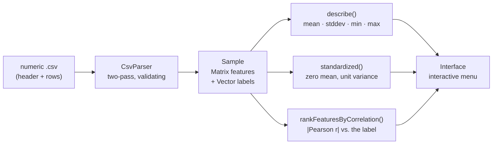

# C++ ML Sandbox - A Linear Algebra and Dataset Engine Written From Scratch

**An interactive C++ playground that loads a real `.csv` dataset and profiles it - summary statistics, feature standardisation, correlation ranking - on top of a `Vector` and `Matrix` layer built on raw owned memory, with no `std::vector` anywhere in the numeric path.**

<p>
  
  
  
  
  
</p>

> ### The thesis
> The container is the lesson, not the convenience.
>
> Every language course reaches for `std::vector` on day one and never looks at what it is hiding. This project deliberately does the opposite: the numeric containers own their memory through `new[]`/`delete[]`, implement the rule of three by hand, and are held to the same standard as a library type - exception-safe assignment, bounds-checked indexing, and a clean run under AddressSanitizer. The ML layer on top exists to give those containers real work to do.

---

## Overview

The program takes a numeric CSV, loads it into an owned feature matrix and label vector, and lets you interrogate it from a text menu:



Four classes, composed rather than inherited: `Interface` owns a `Sample`, a `Sample` composes a `Matrix` with a `Vector`, and `CsvParser` is the only thing that touches the filesystem. `Vector` and `Matrix` are the only classes that manage raw memory, so every other class gets correct copy semantics for free.

---

## The core idea: ownership as the exercise

`std::vector` makes the interesting failure modes invisible. Writing the container by hand makes them the subject:

| Problem the raw buffer creates | How it is handled here |
|---|---|
| A copy constructor that copies the pointer, not the data | `Vector(const Vector&)` routes through `assign()`, which allocates its own buffer |
| Self-assignment (`v = v`) freeing the source | `operator=` guards on `this != &other` |
| A throwing allocation mid-assignment leaving a half-destroyed object | `assign()` allocates the new buffer **before** releasing the old one, so a throw leaves the original intact |
| Silent out-of-bounds writes | `operator[]` throws `std::out_of_range` on both the const and non-const overload |
| Double-free through the row pointers of a matrix | `Matrix::release()` is the single teardown path, called by the destructor and by `operator=` |

The whole test surface runs clean under `-fsanitize=address,undefined`: no leaks, no invalid reads, no undefined behaviour.

A second decision worth naming: **division by zero is a modelling question, not an arithmetic one.** A constant feature column has zero variance, so standardising it is undefined. Rather than emit `NaN` and poison every downstream statistic, `Vector::standardized()` collapses a constant column to zeros - it carries no signal, and saying so explicitly is more useful than propagating a silent `NaN` through the correlation ranking.

---

## What it does

Running the bundled dataset - 60 apartments described by area, room count, age, distance from the centre, and floor, labelled with price:

```console
$ ./build/ml_sandbox --demo data/sample.csv
Loaded 60 observations x 5 features from data/sample.csv

60 observations, 5 features

feature                     mean      stddev         min         max
area_sqm                 104.520      41.379      37.800     179.000
rooms                      3.167       1.496       1.000       6.000
age_years                 27.218      17.116       1.500      59.400
distance_km                8.438       5.198       0.820      17.740
floor                      4.717       3.272       0.000      10.000

label 'price_keur': mean 219.500, stddev 99.455

Features ranked by |correlation| with 'price_keur':

rank  feature                     corr
1     area_sqm                   0.973
2     rooms                      0.924
3     age_years                 -0.227
4     distance_km               -0.046
5     floor                     -0.003
```

The ranking is the first real "model" in the sandbox: correlate every standardised feature column against the standardised label and sort by magnitude. It recovers the structure the sample data was generated with - area dominates, room count follows it because the two are collinear, age pushes price down, and floor is noise.

The interactive menu exposes the same operations one at a time:

| Option | Calls | Notes |
|---|---|---|
| 1. Load a CSV dataset | `CsvParser::load` | Validates the header, field count, and every numeric cell; reports the offending line and column |
| 2. Enter a sample by hand | `Interface::enterSampleManually` | Reads a matrix and a matching label vector from the keyboard; see `tastatura.txt` |
| 3. Summary statistics | `Sample::describe` | Per-column mean, stddev, min, max, plus label balance |
| 4. Rank features by correlation | `Sample::rankFeaturesByCorrelation` | Pearson `r` against the label, sorted by `\|r\|` |
| 5. Standardize features in place | `Sample::standardized` | Rewrites the sample column-wise to zero mean, unit variance |
| 6. Print the raw sample | `operator<<` | Chained through `Matrix` and `Vector`'s own stream operators |
| 7. Clear the sample | `Sample::clear` | Releases both owned buffers |

---

## Repository structure

```
C-ML-Sandbox/
├── include/
│   ├── Vector.h        # owned float buffer: rule of three, bounds-checked [], stats
│   ├── Matrix.h        # owned row pointers, column extraction, column-wise standardisation
│   ├── Sample.h        # composes Matrix + Vector into a labelled dataset
│   ├── CsvParser.h     # the only class that opens a file
│   └── Interface.h     # the only class that reads std::cin
├── src/                # one .cpp per header, plus main.cpp
├── data/sample.csv     # 60-row synthetic apartment-price dataset
├── tastatura.txt       # sample keyboard input for the manual-entry menu path
├── docs/assignment.md  # the original coursework brief and its checklist
├── .github/workflows/  # CI: configure, build and smoke test on Linux and macOS
└── CMakeLists.txt
```

The separation is deliberate and load-bearing: `Vector` and `Matrix` have no idea files exist, `CsvParser` has no idea a terminal exists, and `Interface` is the only place a `std::cin` appears. That is what makes the numeric core testable without stubbing out I/O.

---

## Getting started

```bash
cmake -S . -B build -DCMAKE_BUILD_TYPE=Release
cmake --build build --parallel
```

No dependencies beyond a C++20 compiler and CMake 3.20.

```bash
./build/ml_sandbox                     # interactive menu
./build/ml_sandbox data/sample.csv     # load first, then open the menu
./build/ml_sandbox --demo data/sample.csv   # non-interactive: summary + ranking, then exit
```

`--demo` is what CI runs, so a regression in parsing or in the statistics fails the build rather than waiting for someone to run the menu by hand.

**Input format.** A header row, then numeric rows. The last column is the label; every column before it is a feature.

```csv
area_sqm,rooms,age_years,distance_km,floor,price_keur
82.0,2,39.1,1.77,8,186.0
```

**Running the sanitizers:**

```bash
cmake -S . -B build-asan -DCMAKE_BUILD_TYPE=Debug \
      -DCMAKE_CXX_FLAGS="-fsanitize=address,undefined -g"
cmake --build build-asan --parallel
./build-asan/ml_sandbox --demo data/sample.csv
```

---

## Roadmap

The sandbox currently stops at descriptive statistics and correlation. What it is built toward:

- [ ] Closed-form linear regression (normal equations) on the standardised matrix - needs transpose, multiply, and an inverse on `Matrix`
- [ ] Gradient descent, so the two solutions can be compared step by step
- [ ] k-nearest neighbours, to exercise the distance metrics `Vector` already has the pieces for
- [ ] Train/test split and an error metric on `Sample`
- [ ] Unit tests behind CTest, wired into the existing CI job

---

## Tech stack

`C++20` · `CMake` · `GitHub Actions` · `AddressSanitizer` / `UBSan` - and deliberately nothing else. The standard library appears only where it is not the point of the exercise (`std::string` for column names, `std::sort` for the ranking); every float that belongs to the dataset lives in memory this project allocates and frees itself.

## Coursework

This started as an object-oriented programming project at the University of Bucharest. The original brief and how the code maps onto it: **[docs/assignment.md](docs/assignment.md)**.

---

*Eduard-Gabriel Tudoran, 2026.*
